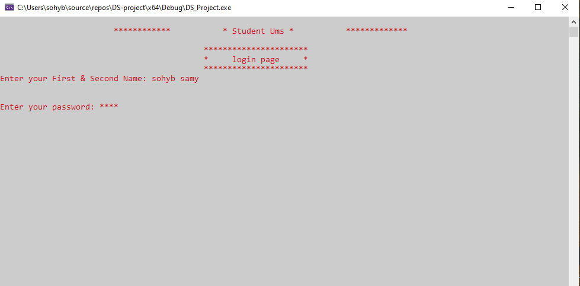
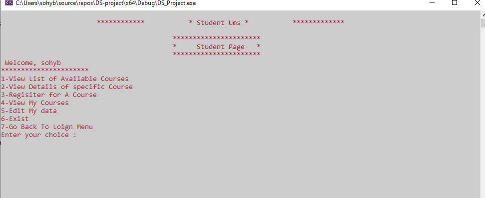
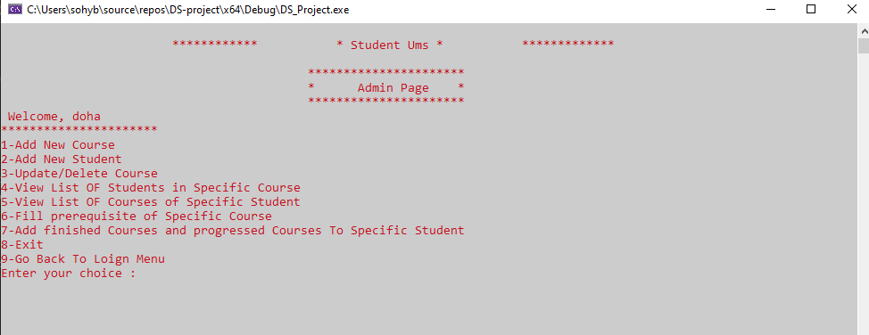
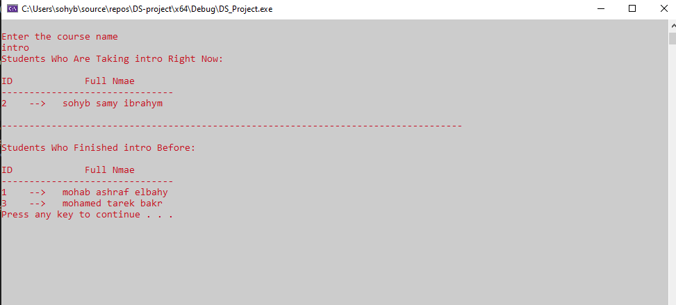

# ✨ Student Prerequisite Subjects Management System

That system store different courses and their prerequisites and based on this it will
allow any student to take any course or not. This project will take the courses list
and their prerequisites list from Admin once then it will allow or disallow the
students from taking the prerequisites.

- C++
- oop & Data Structure concepts
- DataBase using sqlite

# Screenshots

